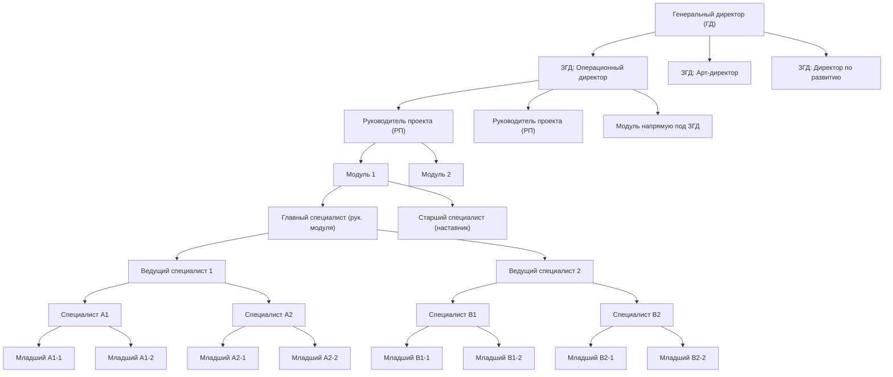

# ТЗ: RAVEZ OS (целевая система управления)

## 1) Цель документа

Этот документ фиксирует, как должна выглядеть полная система RAVEZ OS:
- оргструктура и подчиненность,
- основные бизнес-процессы,
- модули продукта,
- роли и права,
- бюджетирование по направлениям,
- поэтапный план внедрения.

Документ основан на:
- текущем состоянии фронтенда `ravez-os` (React + Vite),
- действующих правилах проекта (`.cursorrules`),
- вашем описании операционной модели (ГД, ЗГД, РП, модульная структура).

## 2) Текущее состояние проекта (as-is)

На фронте уже есть:
- авторизация (`Login`, `useAuth`, JWT `staff_token`);
- базовые модули: `Dashboard`, `Tasks`, `Events`, `Team`, `Shifts`, `Finances`;
- общий layout (sidebar + mobile nav);
- API-клиент через `src/api/client.js`.

Ограничения текущей версии:
- нет полноценной оргмодели уровня "директор -> замы -> РП -> модули";
- нет процесса бюджетирования по направлениям;
- нет сквозной модели согласований;
- role-based логика частично отражена в UI, но не оформлена как целевая матрица доступа;
- часть функций пока MVP-уровня.

## 3) Целевая оргструктура (to-be)

## 3.1 Иерархия управления

Базовая структура:
- **Генеральный директор (ГД)**
  - **Заместители ГД по направлениям (ЗГД)**:
    - операционный директор,
    - арт-директор,
    - директор по развитию,
    - (другие направления при росте).
  - Под каждым ЗГД:
    - руководители проектов (РП),
    - либо модули напрямую (без РП), если направление компактное.

## 3.2 Модульная структура исполнения

Под каждым РП: несколько модулей (обычно 4+).

Внутри модуля:
- главный специалист (руководитель модуля),
- 2 ведущих специалиста,
- специалисты,
- младшие специалисты,
- наставник/старший специалист по обучению.

Примечание по численности: в вводных есть расхождение ("12 человек в модуле" и детализация, дающая больше).  
Базово фиксируем как требование:
- **вариант A:** 12 штатных единиц + 1 наставник (матрицей),
- **вариант B:** 16 штатных единиц (полная пирамида).  
Решение утверждается в блоке "Открытые вопросы".

## 3.3 Типы подчиненности

Система должна поддерживать одновременно:
- **линейную подчиненность** (кто кому подчиняется),
- **функциональную подчиненность** (кто согласует методологию/качество),
- **проектную подчиненность** (назначение на проект/модуль на период).

## 3.4 Схема оргструктуры сотрудников



Упрощенная текстовая схема:

```
ГД
└─ ЗГД (по направлениям)
   ├─ РП (если направление проектное)
   │  └─ Модули
   │     └─ Главный специалист
   │        ├─ 2 x Ведущий специалист
   │        │  └─ у каждого 2 x Специалист
   │        │     └─ у каждого 2 x Младший специалист
   │        └─ Старший специалист (наставник)
   └─ Модули напрямую (если без РП)
```

Правило для системы:
- любой сотрудник должен иметь 1 основного руководителя;
- при этом может иметь функционального наставника и проектного руководителя;
- ветка "ЗГД -> Модуль" поддерживается наравне с веткой "ЗГД -> РП -> Модуль".

## 4) Модули системы

Ниже целевая функциональная карта:

1. **Auth и доступ**
- вход/выход, сессии, роли, разграничение прав.

2. **Оргструктура**
- дерево структуры: ГД -> ЗГД -> РП -> модуль -> сотрудники;
- поддержка прямых модулей под ЗГД (без РП).

3. **Сотрудники (HR Core)**
- карточка сотрудника, роль, грейд, занятость, статус;
- назначение в модуль, перевод между модулями/направлениями.

4. **Проекты**
- карточка проекта, этапы, дедлайны, ответственные;
- привязка модулей к проектам.

5. **Модули**
- паспорт модуля: состав, нагрузка, KPI, план/факт;
- контроль укомплектованности.

6. **Задачи**
- постановка, статусы, исполнители, контроль сроков;
- связка с проектом, направлением, модулем.

7. **Смены/графики**
- планирование смен, конфликты, фактическая отработка;
- связка с payroll и себестоимостью.

8. **События/операции**
- календарь событий, ресурсы, ответственные, статус исполнения.

9. **Бюджетирование и финансы**
- бюджеты по направлениям/проектам/модулям;
- план/факт, лимиты, заявки на расходы, согласование;
- отчетность по отклонениям.

10. **Аналитика**
- KPI по структуре (от ГД до модуля),
- дашборды по загрузке, задачам, бюджету, эффективности.

11. **Согласования**
- маршруты утверждения: ЗГД -> ГД (по лимитам),
- журнал решений и SLA согласования.

12. **Обучение и адаптация**
- назначение наставника,
- контроль onboarding и квалификационных чек-листов.

## 5) Бюджетирование по направлениям (обязательный контур)

## 5.1 Объекты бюджетирования

Система должна вести бюджет минимум по уровням:
- **направление** (операционное, арт, развитие и др.),
- **проект**,
- **модуль**,
- **статья затрат/доходов**.

## 5.2 Структура бюджета

Для каждого направления:
- **доходы** (по источникам),
- **расходы OPEX** (ФОТ, маркетинг, аренда, сервисы, расходники),
- **расходы CAPEX** (оборудование, ремонт, внедрения),
- **резервы** и непредвиденные,
- **лимиты согласования**.

## 5.3 План-факт цикл

Периодичность:
- год -> квартал -> месяц -> неделя.

Процесс:
1) Формирование планов (bottom-up от модулей/РП, top-down от ЗГД).  
2) Согласование и утверждение.  
3) Фиксация факта (ручная или через интеграции).  
4) Анализ отклонений (план vs факт).  
5) Корректирующие действия и re-forecast.

## 5.4 Бюджетные статусы

Минимальные статусы:
- draft,
- on_review,
- approved,
- rejected,
- locked,
- archived.

## 5.5 Правила согласования

Пример базовой матрицы:
- модуль -> РП (если есть),
- РП/модуль -> ЗГД,
- выше лимита направления -> ГД.

Каждое решение хранит:
- кто согласовал,
- когда,
- комментарий,
- версию бюджета.

## 6) Роли и права доступа (RBAC)

Минимально необходимые роли управления:
- `ceo` (ГД),
- `deputy_director` (ЗГД),
- `project_lead` (РП),
- `module_lead` (главный специалист),
- `lead_specialist`,
- `specialist`,
- `junior_specialist`,
- `mentor` (наставник),
- `accountant`,
- `hr`,
- `admin` (системный).

Требования к доступу:
- чтение и редактирование "по своей ветке" оргструктуры;
- запрет на изменение чужих направлений без прав;
- финансы и бюджеты редактируются только уполномоченными ролями;
- ГД видит и утверждает все уровни.

## 7) Основные бизнес-процессы (сквозные)

1. **Оргпроектирование**
- создание/изменение структуры направлений, РП и модулей.

2. **Кадровый процесс**
- назначение сотрудника в модуль, роль, наставника, период.

3. **Планирование работ**
- задачи и смены на основе проектных целей и загрузки модулей.

4. **Исполнение и контроль**
- ежедневный контроль задач, еженедельный контроль загрузки.

5. **Бюджетирование**
- планирование бюджета, утверждение, контроль лимитов, план/факт.

6. **Управленческая отчетность**
- KPI, отклонения, риски, действия по исправлению.

## 8) Нефункциональные требования

- Mobile-first UI (375px+), desktop версии для управленцев.
- Единый стиль UI и русскоязычные интерфейсы.
- Все API-вызовы через `api.get/api.post`.
- Обязательные состояния: loading/error/empty/success.
- Аудит-лог ключевых действий (изменение структуры, бюджета, прав).
- Производительность дашбордов: загрузка ключевых экранов <= 2-3 сек при рабочем объеме.

## 9) KPI системы (что считаем успешным внедрением)

- 100% сотрудников привязаны к структуре и роли.
- 100% задач привязаны к проекту/модулю/ответственному.
- >= 95% бюджета направлений ведется в системе (не в таблицах вне системы).
- Снижение просрочки задач (цель задается на внедрении).
- Время подготовки управленческого отчета сокращено минимум в 2 раза.

## 10) План внедрения (поэтапно)

## Этап 1. Фундамент
- стабилизация auth и ролей;
- справочники ролей/структуры;
- базовая матрица доступа.

## Этап 2. Оргмодель
- модуль "Оргструктура";
- поддержка сценария "ЗГД -> модуль напрямую";
- кадровые назначения и переводы.

## Этап 3. Операционный контур
- проекты, модули, задачи, смены;
- контроль исполнения по KPI.

## Этап 4. Бюджетирование
- бюджет направлений/проектов/модулей;
- план/факт, лимиты, согласование.

## Этап 5. Аналитика и отчетность
- управленческие дашборды для ГД/ЗГД/РП;
- отчеты по отклонениям и эффективности.

## Этап 6. Полировка и масштабирование
- UX-улучшения,
- автоматизация интеграций,
- регламенты эксплуатации.

## 11) Изменения в текущем фронте (минимально необходимый backlog)

1. Привести мобильную навигацию и роуты в соответствие.  
2. Добавить единый error-layer на всех страницах.  
3. Вынести крупные page-файлы в компоненты.  
4. Добавить role-gating по ветке подчиненности.  
5. Добавить новый модуль "Оргструктура".  
6. Добавить "Проекты" и "Модули" как отдельные сущности.  
7. Реализовать блок "Бюджеты" с план/факт и согласованием.  
8. Добавить управленческие дашборды по уровням (ГД/ЗГД/РП/модуль).  

## 12) Открытые вопросы для финализации ТЗ

1. Точная численность модуля: 12 или 16 (и входит ли наставник в штат модуля).  
2. Полный список направлений и их владельцев (ЗГД).  
3. Лимиты согласования бюджета (по суммам и типам статей).  
4. Какие финансовые данные грузятся автоматически, а какие вручную.  
5. Нужна ли мульти-площадка (несколько клубов/филиалов).  
6. Обязательные отчеты для ГД (ежедневно/еженедельно/ежемесячно).  

## 13) Наследие из папки "старое" (обязательно учесть)

Источник: `старое/staff.html`, `старое/staff-app.js`.

Из старой системы уже есть готовая предметная карта, которую нужно перенести в новый продукт:

- **Ролевой контур и доступы**
  - 18 ролей (`hq`, `owner`, `director`, `dev_director`, `art_director`, `admin`, и др.).
  - role-based видимость разделов.
  - отдельный модуль прав (`permissions/all`, `permissions/save`).

- **Функциональные разделы (по факту эксплуатации)**
  - Операции: дашборд, брони, вход, четверги.
  - Команда: задачи, смены, зарплаты, команда, права.
  - Контент/ивенты: события, вечеринки, контент, DJ.
  - Гости: CRM гостей, лояльность, промо.
  - Управление: финансы, аналитика, AI, интеграции, профиль.

- **Финансы и зарплаты**
  - финансы: `finances/summary`, `finance/save`, `finance/delete`;
  - настройки зарплат: `salary/settings/get|list|save`;
  - начисления и выплаты: `salary/accrual/get|create|delete|pay`, `salary/calculate`, `salary/stats`.

- **Гости и лояльность**
  - гости: `guests`, `guest/get`, `guest/save`, `guest/delete`, `guest/blacklist`;
  - баллы/тиеры: `loyalty/tiers`, `loyalty/rules`, `loyalty/redemption-rules`, `loyalty/earn`, `loyalty/spend`.

- **Интеграции и коммуникации**
  - `integrations/list`, `integrations/test`, `integrations/settings/save`;
  - рассылки: `integrations/broadcast`, `messages/list`.

### 13.1 Правило миграции

При разработке новой версии:
- не теряем бизнес-возможности из старого контура;
- переносим модули по приоритету (сначала ядро: Auth/Org/Tasks/Shifts/Finances, затем Salary/Guests/Loyalty/Integrations);
- каждый модуль в новом UI должен иметь статус миграции: `planned`, `in_progress`, `done`, `deprecated`.

### 13.2 Приоритет переноса в новую систему

1. **P0**: Auth, Team, Tasks, Shifts, Finances, базовая Analytics.  
2. **P1**: Salary (настройки + начисления + выплаты).  
3. **P1**: Guests CRM + Loyalty (тиеры/правила/начисления).  
4. **P2**: Integrations + Broadcast + AI-инструменты.  
5. **P2**: Продвинутые панели (Owner/Thursday/Party/Content/Promoters).  

---

## Результат этого ТЗ

После утверждения этого документа можно делать:
- детальную декомпозицию в backlog,
- проектирование API-контрактов по новым сущностям,
- поэтапную реализацию "по порядку" без хаоса.
